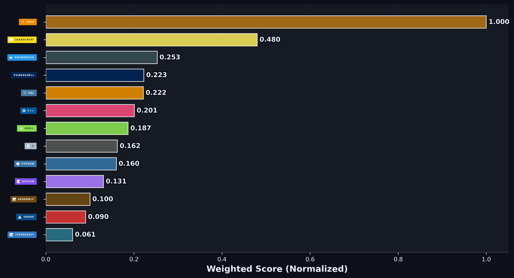

# Alexander Kukharev

Full-stack Java / C++ developer.
5 years of commercial experience.
Building web systems, Android applications, and a custom C++ game engine.

## Tech stack

Java, Spring Boot, PostgreSQL, Docker, JavaScript, React, Android, Kotlin, C++, CMake, DirectX.

## GitHub statistics

## Contacts

GitHub: [ImMedved](https://github.com/ImMedved)
